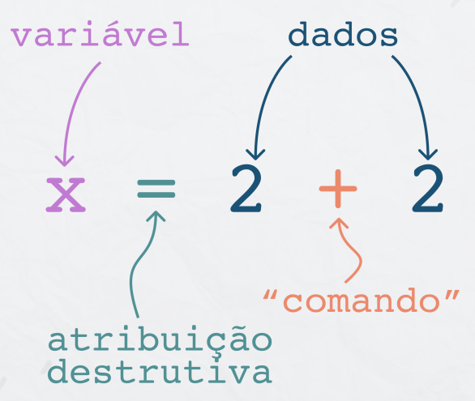
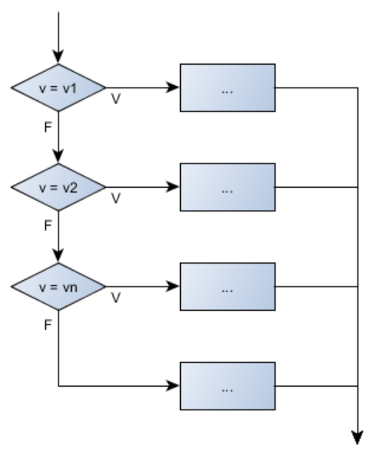
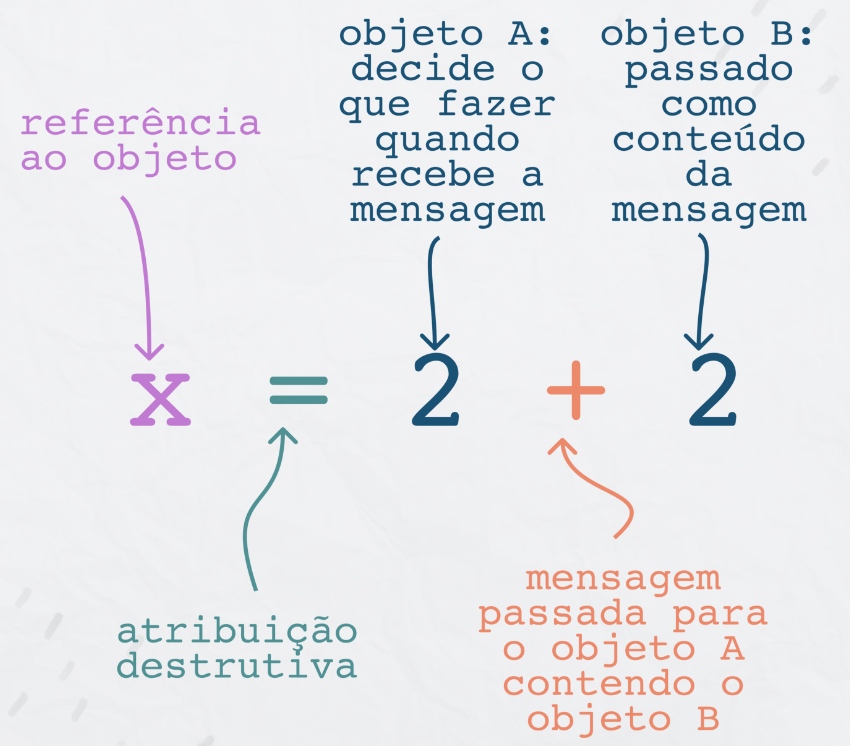

<h1 align="center">
  
</h1>

# Introdução a Orientação a Objeto

Turma Online 21 - Imersão JavaScript | Semana 3 | 2022 | Professora Jéssica Osko

### Instruções
Antes de começar, vamos organizar nosso setup.
* Fork esse repositório 
* Clone o fork na sua máquina (Para isso basta abrir o seu terminal e digitar `git clone url-do-seu-repositorio-forkado`)
* Entre na pasta do seu repositório (Para isso basta abrir o seu terminal e digitar `cd nome-do-seu-repositorio-forkado`)
* [Add outras intrucoes caso necessario]

### Objetivo
Introduzir o conceito de paradigma de programação, comparando a POO com a programação estruturada. Cobrir classe e objeto e qual é a diferença entre os dois conceitos. Começar a apresentar os pilares da POO.

### Resumo
O que veremos na aula de hoje?
- [Introdução a Orientação a Objeto](#introdução-a-orientação-a-objeto)
    - [Instruções](#instruções)
    - [Objetivo](#objetivo)
    - [Resumo](#resumo)
- [Conteúdo](#conteúdo)
  - [Paradigma de Programação](#paradigma-de-programação)
      - [O que são e para que servem](#o-que-são-e-para-que-servem)
      - [Paradigma de programação imperativo](#paradigma-de-programação-imperativo)
      - [Paradigma de Programação Estruturado](#paradigma-de-programação-estruturado)
      - [Paradigma de Programação Orietado a Objetos](#paradigma-de-programação-orietado-a-objetos)
    - [Exercícios](#exercícios)
    - [Links Úteis](#links-úteis)

- [Conteúdo](#conteúdo)

  - [Exemplo](#exemplo)
    - [O que são e para que servem ](#o-que-são-e-para-que-servem)
    - [Benefícios](#benefícios)
    - [Abordagens](#abordagens)
    - [Implementação](#implementação)
  
  - [Outro Exemplo](#outro-exemplo)
    - [ETCETC](#etcetc)

  - [Exercícios](#exercícios)
  - [Material da aula](#material-da-aula)
  - [Links Úteis](#links-úteis)

# Conteúdo

## Paradigma de Programação  
  #### O que são e para que servem
  Paradigma é um método ou modelo de como resolver determinado problema ou realizar uma tarefa. Por exemplo, a fórmula de bhaskara pode ser considerada um paradigma para encontrar as raízes em uma equação de 2º grau. Em programação, paradigma é uma abordagem para resolver problemas usando alguma linguagem de programação, ou ainda, um método para resolver um problema usando ferramentas e técnicas que estão disponíveis para nós seguindo alguma abordagem.

  O termo paradigma de programação refere-se a um estilo de programação. Não se refere a uma linguagem de programação específica, mas sim à maneira como você programa.

  Existem muitas linguagens de programação que são bem conhecidas, mas todas precisam seguir alguma estratégia quando implementadas. E essa estratégia é um paradigma.

  #### Paradigma de programação imperativo
É um dos paradigmas mas antigos e comuns, a partir dele outro paradigmas muito utilizados hoje foram criados. Possui estreita relação com a arquitetura da máquina. É baseado na arquitetura de Von Neumann. Ele funciona alterando o estado do programa por meio de instruções de atribuição. Ele executa a tarefa passo a passo, alterando o estado. O foco principal é como atingir o objetivo. O paradigma consiste em várias instruções e após a execução de todo o resultado é armazenado.

<h1 align="center">
  
</h1>

*Vantagens*:

- Muito simples de implementar;

*Desvantagens*:

- Problemas complexo não podem ser resolvidos;
- Menos eficiente e menos produtivo;
- A programação paralela não é possível.

*Linguagens*:

- C;
- Pascal;
- BASIC;
- Fortran;
- COBOL.
  
  #### Paradigma de Programação Estruturado
O paradigma estruturado é uma ramificação do paradigma imperativo, em que as instruções passadas ao computador podem ser formadas por 3 estruturas, sendo: (1) sequência: as instruções são codificadas na sequência a serem executadas; (2) condição: um bloco de código só é executado se uma condição for verdadeira; (3) repetição: um trecho de código pode ser executado repetidas vezes. É baseado no paradigma imperativo.

<h1 align="center">
  
</h1>

*Vantagens:* 

- A estrutura do programa é clara, já que as instruções estão mais conectadas ou relacionadas entre si;
- Capacidade de modularização criando funções ou subrotinas;
- Fácil de manter, debugar e testar.

*Desvantagem:*

- Tipos de dados são resultado de muitas funções em um programa estruturado. Quando ocorrem alterações nesses tipos de dados, a alteração correspondente deve ser feita em todos os locais que atuam nesses tipos de dados dentro do programa;
- Não é adequada para o desenvolvimento de grandes programas.

  #### Paradigma de Programação Orietado a Objetos
A programação orientada a objetos é uma ramificação do paradigma imperativo, que fornece um modelo no qual um programa é uma coleção de objetos que interagem entre si, passando mensagens que transformam seu estado.

<h1 align="center">
  
</h1>

*Vantagens:*

- Aumento da produtividade de desenvolvimento, objetos podem ser reutilizados e extendidos;
- Melhorias mais rápidas;
- Redução de custo de desenvolvimento;
- Promoção de boas práticas, gerando software de qualidade.

*Desvantagens:*

- Programas maiores por conta de diversas classes e objetos;
- Em geral, os programas possuem execução mais lenta por conta dos requisitos requeridos;
- Curva de aprendizado aumentada.

Linguagens:

- C++;
- Java;
- C#;
- Ruby.
  
***
### Exercícios 
* [Exercicio para sala](/exercicios/para-sala/)
* [Exercicio para casa](/exercicios/para-casa/)

### Links Úteis
* [Paradigma de Programação](https://en.wikipedia.org/wiki/Programming_paradigm)
* [Introdução a Paradigma de Programação](https://www.geeksforgeeks.org/introduction-of-programming-paradigms/)
* [Paradigmas de Programação](https://medium.com/zeroeumas/paradigmas-de-programacao-845ecf7b4aaf)

Desenvolvido com :purple_heart:  

