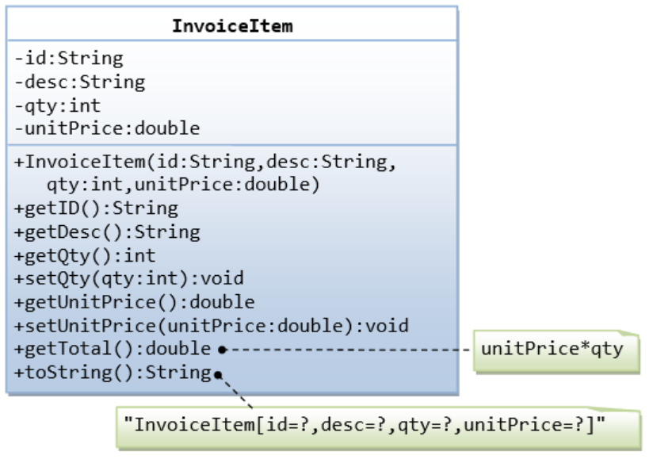

# Exercício de Casa 🏠 

## Nome do Exercicio

- Explicação do exercício: 
Escreva uma classe chamada Employee, que modela um funcionário com os atributos id, name e salary. O método raiseSalary(percent) aumenta o salário baseado numa dada porcentagem.
 Em seguida, escreva todos os metódos que contém na imagem abaixo.

 <h1 align="center">
  
</h1>

---

Terminou o exercício? Dá uma olhada nessa checklist e confere se tá tudo certinho, combinado?!

- [ ] Fiz o fork do repositório.
- [ ] Clonei o fork na minha máquina (`git clone url-do-meu-fork`).
- [ ] Criei minha branch (` git checkout -b nome-sobrenome `)
- [ ] Criei a pasta com o meu nome dentro da pasta entregas (` mkdir nome-sobrenome`)
- [ ] Resolvi o exercício dentro da minha pasta. Como no [exemplo](/on21-imersao-js-S1-TDD/exercicios/para-casa/entregas/exemplo-nome-sobrenome/).
- [ ] Adicionei as mudanças. (`git add .` para adicionar todos os arquivos, ou `git add nome_do_arquivo` para adicionar um arquivo específico)
- [ ] Commitei a cada mudança significativa ou na finalização do exercício (`git commit -m "Mensagem do commit"`)
- [ ] Pushei os commits na minha branch (`git push origin nome-da-branch`)
- [ ] Criei um Pull Request seguindo as orientações que estao nesse [documento](/on21-imersao-js-S1-TDD/exercicios/para-casa/instrucoes-pull-request.md).
